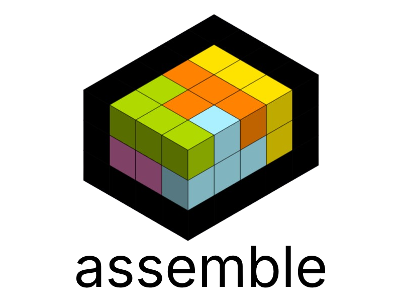

# Assemble

<p align="center">
  
</p>

Assemble is a command-line application for analyzing Flutter project dependencies. It provides functionality to check for outdated dependencies and visualize the dependency graph.

## Table of Contents

- [Installation](#installation)
- [Usage](#usage)
- [Commands](#commands)
- [Contribution](#contribution)
- [License](#license)

## Installation

To install Assemble, you need to have Dart SDK installed on your machine. You can activate the tool globally using:

```bash
dart pub global activate assemble
```

## Usage
```bash
assemble [command] [options]
```

## Commands
```bash
assemble analyze --outdated --graph
```

## Contribution
1. Create your own fork of the project.
2. Make a new branch for your feature or fix.
3. Implement your changes and commit them.
4. Push to your branch.
5. Create a pull request, submit your changes for review.

## License
This project is licensed under the MIT License. See the [LICENSE](LICENSE) file for details.

